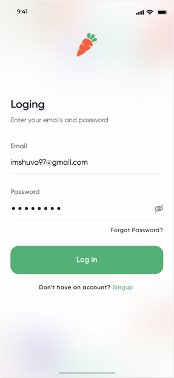
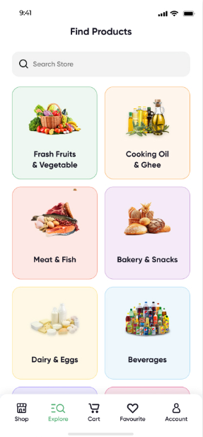
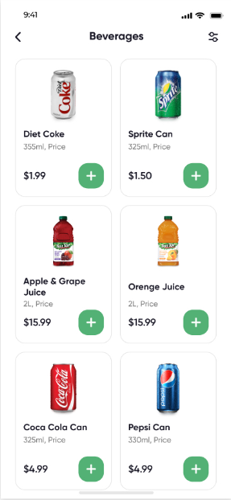
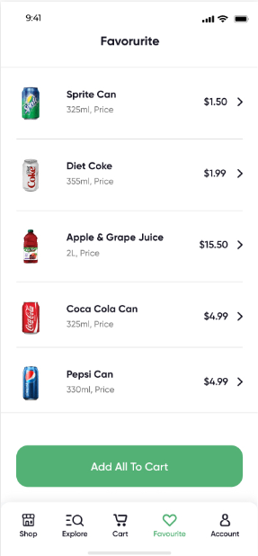
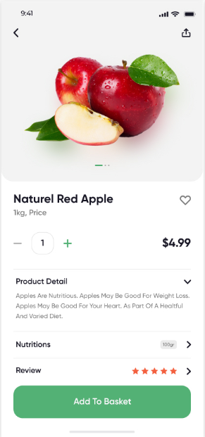
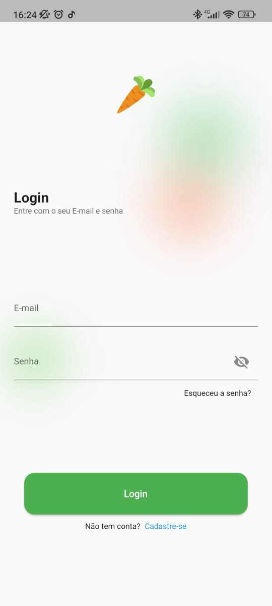
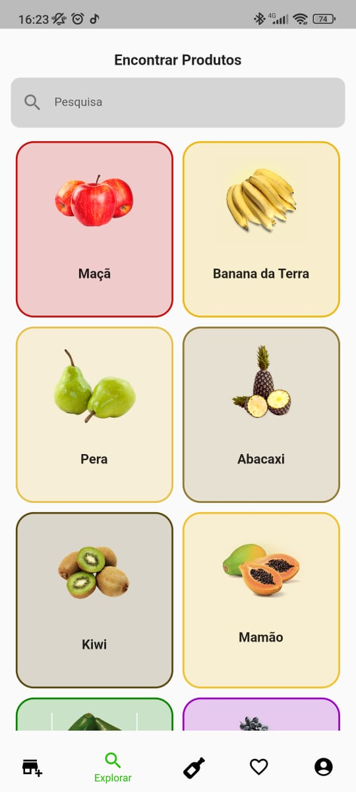
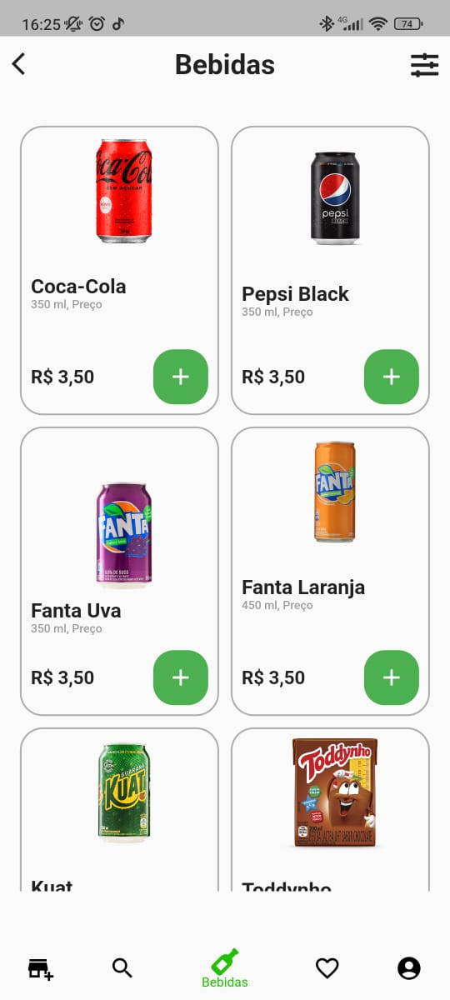
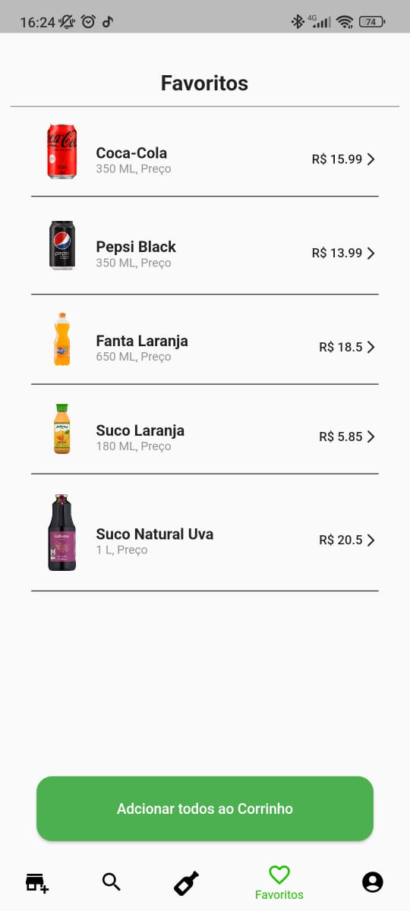
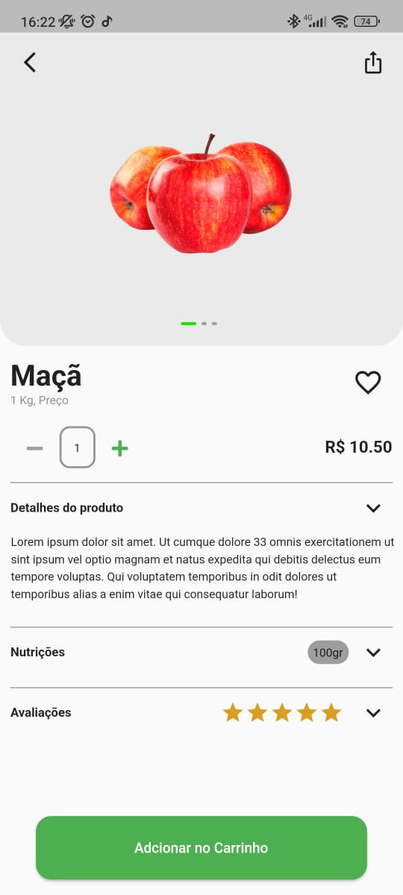

# fruit_market

Primeiro projeto da matéria de Desenvolvimento de Aplicativos Mobile, que consiste em utilizar um modelo de aplicação sorteado pelo professor e replicar 5 telas.

## Colaboradores

- [Gustavo Coelho](https://github.com/gcostacoelho)
- [Mateus Moraes](https://github.com/Mateus11Toledo)
- [Hellen Turri](https://github.com/hellenTurri)
- [Karin Kagi](https://github.com/karinkagi)

## Telas de Modelo

    
    
    
    
    

## Telas da Aplicação

    
    
    
    
    

